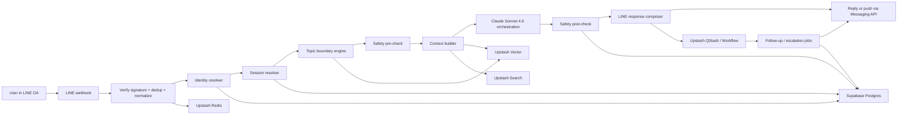

# LINE OA Mental Health SaaS Architecture

This baseline is designed for a real LINE Official Account deployment with:

- `Next.js` as the application and orchestration layer
- `Supabase` as the relational system of record
- `Upstash Redis` for hot state, locks, dedup, and rate limits
- `Upstash Vector` for semantic memory and topic similarity
- `Upstash Search` for keyword and hybrid retrieval over summaries and admin search
- `Upstash QStash/Workflow` for follow-ups, delayed jobs, and escalation pipelines
- `Anthropic Claude API` with `claude-sonnet-4-6` as the primary model

No mental-health AI is truly "perfect". The practical target is to close the main failure modes: wrong identity, lost continuity, unsafe responses, over-retention, missed escalation, and poor LINE UX.

## What To Open

### Required

1. `LINE Official Account` and enable `Messaging API`
   - Core inbound and outbound channel
   - Free to start
   - Reply messages are cost-efficient because LINE does not count reply messages toward monthly message quota; push/multicast/broadcast/narrowcast do count

2. `Anthropic API`
   - Required for the chatbot itself
   - This is the one unavoidable paid service in your stack

3. `Supabase`
   - Use the free plan first
   - System of record for users, sessions, messages, consents, risk events, and audit logs

4. `Upstash Redis`
   - Required
   - Use for webhook dedup, event idempotency, reply locks, rate limiting, and short-lived conversation state

5. `Upstash Vector`
   - Required
   - Use for semantic topic boundary detection and long-term memory retrieval

6. `Upstash QStash` and `Upstash Workflow`
   - Required
   - Use for delayed follow-ups, safety check-ins, retries, and human-handoff workflows

7. Hosting for Next.js
   - `Vercel Hobby` is the cleanest free starting point for App Router webhooks and public URLs
   - Cloudflare is also viable, but if you want the shortest path, start on Vercel

### Recommended

1. `Upstash Search`
   - Recommended, not required for v1
   - Use for keyword and hybrid retrieval over session summaries, admin search, QA investigations, and complaint review

2. `LINE Login`
   - Optional for chatbot core
   - Recommended if you want a web portal, account linking, therapist dashboard login, or LIFF onboarding
   - Keep the `LINE Login` channel under the same `provider` as your `Messaging API` channel so the user ID stays aligned

3. `LIFF`
   - Optional
   - Useful for consent forms, self-assessment, and opening a web UI from inside LINE

4. `Sentry`
   - Optional and free to start
   - Use for error tracking and incident triage

5. `PostHog`
   - Optional and free to start
   - Use for product analytics, drop-off analysis, and retention funnels

6. `Cloudflare Turnstile`
   - Optional and free
   - Use on any public web intake form or counselor portal to reduce abuse

## Platform Facts That Matter

1. LINE sends webhooks to your bot server when a user adds the OA or sends a message.
2. You must verify the LINE webhook signature before processing.
3. LINE provides `source.userId` in the webhook when available, and `webhookEventId` for duplicate detection.
4. LINE may redeliver webhooks, so idempotency is mandatory.
5. LINE supports both `reply` and `push` messaging.
6. Reply messages are not counted toward monthly message quota; push-style sends are counted.
7. `Messaging API` and `LINE Login` share the same user ID if they are under the same `provider`.
8. In some cases LINE may omit `source.userId` if the user has not consented to profile access, so you need a degraded-mode fallback.

## System Overview



## Recommended Runtime Split

### Synchronous hot path

Keep this inside the webhook request:

1. Verify LINE signature
2. Read `webhookEventId`
3. Acquire a Redis idempotency lock
4. Resolve or create the user
5. Load active session and recent summary
6. Run safety pre-check
7. Run topic boundary detection
8. Build minimal context
9. Call Claude
10. Run output safety check
11. Reply quickly

### Asynchronous cold path

Push these behind QStash/Workflow:

1. Session summarization
2. Memory writes
3. Embedding generation and vector upserts
4. Search document upserts
5. Follow-up scheduling
6. Escalation workflows
7. Analytics materialization
8. Admin case queue updates

This split matters because LINE explicitly recommends asynchronous webhook processing, and webhook redelivery means your system must be tolerant to repeats and ordering issues.

## Identity Design

### Primary identifiers

- `line_user_id`
  - From `source.userId`
  - External identifier
- `user_id`
  - Internal UUID
  - Primary key used across your system
- `line_provider_id`
  - Helps if you later operate multiple LINE providers or environments

### Fallback identity behavior

If `source.userId` is missing:

1. Accept the message in degraded mode
2. Do not promise continuity across future turns
3. Do not schedule push follow-ups
4. Ask the user to continue in normal LINE 1:1 flow or complete account linking if needed

### Consent model

Separate consent from profile data:

- `privacy consent`
- `long-term memory consent`
- `research consent`
- `human-handoff consent`
- `trusted-contact consent`

Do not overload a single boolean.

## The Real Fix For LINE Single Thread

LINE is one physical thread, so you need many virtual sessions under one LINE conversation.

### Core model

- `conversation`
  - One stable container per LINE user
- `session`
  - One topic-specific virtual conversation
- `message`
  - One inbound or outbound turn

The user stays in one LINE chat. Your backend decides whether the current message:

1. continues the active session
2. opens a new session
3. reopens a previous session
4. interrupts everything for crisis mode

### Session state machine

- `active`
- `dormant`
- `closed`
- `escalated`
- `crisis_locked`

## Topic Boundary Engine

This is the product moat.

### Inputs

- latest user message
- last `6-12` turns
- active session summary
- top `3-5` prior session summaries
- time gap since last user turn
- current risk state
- quick-reply action, if any

### Decision policy

Use hybrid logic, not LLM-only logic.

#### Layer 1: deterministic triggers

Open new session immediately when:

- user taps `เริ่มเรื่องใหม่`
- user writes explicit shift text such as `เรื่องใหม่`, `อีกเรื่อง`, `เปลี่ยนเรื่อง`
- active session is `closed` and gap is large
- current session is `crisis_locked` and the new message is obviously unrelated after resolution

#### Layer 2: temporal rules

- `> 8 hours` without activity: soft candidate for a new session
- `> 72 hours`: strong candidate

#### Layer 3: semantic similarity

Compute similarity between:

- current message vs active session summary
- current message vs unresolved summary items
- current message vs recent closed session summaries

Use Upstash Vector here.

#### Layer 4: LLM topic resolver

Only for ambiguous cases.

Use structured JSON like:

```json
{
  "is_new_topic": true,
  "confidence": 0.88,
  "topic_label": "family_conflict",
  "relation_to_previous": "shift",
  "should_open_new_session": true,
  "should_reopen_prior_session_id": null,
  "user_confirmation_needed": false
}
```

### Confidence bands

- `>= 0.80`: auto-open or auto-switch
- `0.55 - 0.79`: ask the user via quick replies
- `< 0.55`: keep current session

### UX pattern

When confidence is medium:

`ฟังดูเหมือนเป็นอีกเรื่องหนึ่งจากที่คุยก่อนหน้า`

Quick replies:

- `เปิดหัวข้อใหม่`
- `คุยต่อเรื่องเดิม`

That is how you recreate "new chat" on top of a single LINE thread.

## Memory Architecture

Do not treat all messages as long-term memory.

### Layers

1. `raw_messages`
   - Immutable event log
   - Short retention
   - Needed for audit, QA, and incident review

2. `session_summaries`
   - Durable
   - Core continuity layer

3. `user_memories`
   - Only stable facts and preferences
   - Example: preferred response style, recurring triggers, prior coping tools that helped

4. `risk_memory`
   - Separate access policy
   - Includes prior high-risk flags, safety plans, and escalation history

### Memory gate

Write memory only when all conditions pass:

1. it is stable across time
2. it helps future support quality
3. consent allows it
4. sensitivity tier is acceptable
5. a TTL is defined

Example write decision:

```json
{
  "should_write": true,
  "memory_type": "preference",
  "content": "User prefers concise and gentle responses after 11pm",
  "sensitivity": "medium",
  "ttl_days": 90
}
```

## Why Use Both Upstash Vector And Upstash Search

### Upstash Vector

Use on the hot AI path:

- topic similarity
- memory retrieval
- prior-session retrieval
- semantic de-duplication of repeated issues

### Upstash Search

Use on the analysis and admin path:

- keyword retrieval over summaries
- counselor search
- incident and complaint review
- hybrid retrieval where exact keywords matter
- policy snippets and scripted interventions

### Rule of thumb

- `Vector` is mandatory for the chatbot brain
- `Search` is optional for v1, but valuable for admin QA and hybrid retrieval

If you want to minimize moving parts at first, the first thing to defer is `Search`, not `Vector`.

## Safety Layers

This stack should have multiple independent checks.

### Layer 0: product boundary

The bot must clearly state:

- not an emergency service
- not a clinician
- not a diagnosis engine
- emotional support and guided self-help only

### Layer 1: safety pre-check

Before main generation:

- self-harm risk
- suicide intent
- violence risk
- abuse and coercion
- hallucination-sensitive medical claims

Use rules plus model classification.

### Layer 2: response planner

Claude returns structure, not only free text.

Example:

```json
{
  "mode": "reflective_listener",
  "risk_level": "medium",
  "topic": "exam_stress",
  "needs_handoff": false,
  "should_schedule_followup": true,
  "followup_delay_hours": 18,
  "message_draft": "..."
}
```

### Layer 3: safety post-check

Reject or rewrite outputs that:

- provide harmful instructions
- overclaim confidentiality
- present false clinical authority
- create emotional dependency
- shame or coerce the user
- fabricate emergency readiness

### Layer 4: crisis protocol

If risk is high or imminent:

1. stop normal supportive conversation
2. switch to crisis mode
3. keep language short and direct
4. provide immediate help options
5. offer human handoff
6. trigger follow-up workflow

### Layer 5: human review lane

Create an admin case when:

- repeated high-risk interactions
- model confidence is low
- safety policy rewrite happened multiple times
- user complains or asks for a real person

### Layer 6: abuse and jailbreak protection

Detect:

- prompt injection
- sexual harassment
- adversarial probing
- spam
- automated flooding

The system should hold boundaries without escalating tone.

## Response Modes

Keep a small, controlled set of output styles:

- `gentle_short`
- `reflective_listener`
- `grounding_coach`
- `psychoeducation_light`
- `crisis_mode`

Do not let the bot improvise a therapist persona.

## Data Model

### Supabase tables

- `users`
- `line_identities`
- `user_profiles`
- `consents`
- `conversations`
- `sessions`
- `messages`
- `session_summaries`
- `user_memories`
- `risk_events`
- `handoffs`
- `followups`
- `audits`

### Suggested key fields

#### users

- `id`
- `timezone`
- `language`
- `risk_baseline`
- `memory_consent_status`
- `created_at`

#### line_identities

- `user_id`
- `line_user_id`
- `line_provider_id`
- `display_name_snapshot`
- `picture_url_snapshot`
- `last_seen_at`

#### sessions

- `id`
- `user_id`
- `status`
- `topic_label`
- `linked_prior_session_id`
- `risk_peak`
- `opened_at`
- `closed_at`

#### messages

- `id`
- `session_id`
- `line_webhook_event_id`
- `line_message_id`
- `role`
- `content_type`
- `content_text`
- `safety_label`
- `redelivery_flag`
- `created_at`

#### session_summaries

- `session_id`
- `summary_text`
- `unresolved_items`
- `coping_attempts`
- `emotion_tone`
- `last_updated_at`

## Unsend, Redelivery, And Audit

These are commonly ignored and they matter in mental health.

### Unsend

LINE can send unsend events. If a user unsends content:

1. remove the raw content from any user-facing admin screens
2. tombstone or delete retained raw copies according to policy
3. preserve only the minimum audit trace needed

### Redelivery

Use `webhookEventId` as the idempotency key in Redis before writing or responding.

### Audit

Version all of these:

- prompts
- safety policies
- crisis templates
- memory rules
- consent text

You need post-incident explainability.

## Cost Control Decisions

1. Prefer `reply` for live conversation because LINE does not count reply messages toward the monthly message quota.
2. Reserve `push` for follow-ups, escalation, and recovery workflows.
3. Summarize asynchronously, not inside the hot path.
4. Keep hot-path context narrow: recent turns + active summary + selected memory only.
5. Use one primary model family to reduce drift. Start with `claude-sonnet-4-6`.
6. Add a template fallback for outages instead of silently failing.

## Next.js App Layout

```text
src/
  app/
    api/
      line/
        webhook/route.ts
      internal/
        followups/route.ts
        escalations/route.ts
      admin/
        cases/route.ts
        cases/[id]/route.ts
        metrics/route.ts
      auth/
        line/callback/route.ts
  modules/
    line/
      verify-signature.ts
      messaging-client.ts
      rich-menu.ts
    identity/
      resolve-line-user.ts
    sessions/
      session-resolver.ts
      topic-boundary-engine.ts
    safety/
      precheck.ts
      postcheck.ts
      crisis-protocol.ts
    llm/
      anthropic-client.ts
      prompts/
        topic-resolver.ts
        safety-assessor.ts
        response-planner.ts
        summary-writer.ts
    memory/
      memory-gate.ts
      vector-store.ts
      search-store.ts
    jobs/
      enqueue-followup.ts
      enqueue-summary.ts
      enqueue-escalation.ts
    db/
      queries/
      mutations/
```

## Recommended Claude Usage

Use one model family with structured outputs:

- `claude-sonnet-4-6` for main conversation planning
- `claude-sonnet-4-6` for topic resolver
- `claude-sonnet-4-6` for safety assessor
- `claude-sonnet-4-6` for summary writer

If you need cost reduction later, downgrade only the summary writer first.

## Recommended Service Mapping

### Supabase

- relational data
- row-level security for admin portal
- storage buckets for attachments and exports
- optional auth for staff dashboard

### Upstash Redis

- webhook dedup by `webhookEventId`
- per-user locks
- rate limits
- active session cache
- transient risk state

### Upstash Vector

- embedding storage for summaries and memory
- nearest-neighbor topic matching
- semantic recall

### Upstash Search

- search index for summaries and admin investigations
- hybrid lexical retrieval
- keyword-sensitive recall

### QStash / Workflow

- delayed follow-ups
- retry jobs
- crisis check-ins
- handoff workflows
- notification fanout

## LINE Login Decision

### Not required for the chatbot itself

You do not need `LINE Login` just to know who is talking in the OA webhook.

### Recommended when any of these are true

1. you want a web dashboard for users
2. you want LIFF onboarding and consent capture
3. you want to link OA identity to an internal patient, employee, or student record
4. you want one identity across web and chat

If you create `LINE Login`, put it under the same `provider` as the `Messaging API` channel.

## Launch Order

### v1

1. LINE webhook ingestion
2. signature verification and dedup
3. user resolution
4. virtual sessions
5. topic boundary engine
6. safety pre-check and post-check
7. Claude structured planner
8. quick replies for `เรื่องใหม่` vs `เรื่องเดิม`
9. QStash follow-up jobs
10. basic admin review queue

### v1.5

1. LIFF consent flow
2. human handoff queue
3. mood check-ins
4. attachment ingestion
5. Upstash Search for admin and hybrid retrieval

### v2

1. organization-specific counselor dashboard
2. therapist notes interoperability
3. multilingual Thai-English flows
4. evaluation harness and safety scorecards

## Bottom Line

The winning architecture is not "one chatbot API call".

It is:

- `LINE OA` as channel
- `Next.js` as orchestrator
- `Supabase` as source of truth
- `Upstash Redis` as real-time control plane
- `Upstash Vector` as semantic continuity
- `Upstash Search` as hybrid retrieval and admin search
- `QStash/Workflow` as delayed execution and escalation
- `Claude Sonnet 4.6` as reasoning engine
- `multi-layer safety` as the governor over everything

That is the version that actually handles LINE's single-thread constraint and closes the biggest market gaps.
